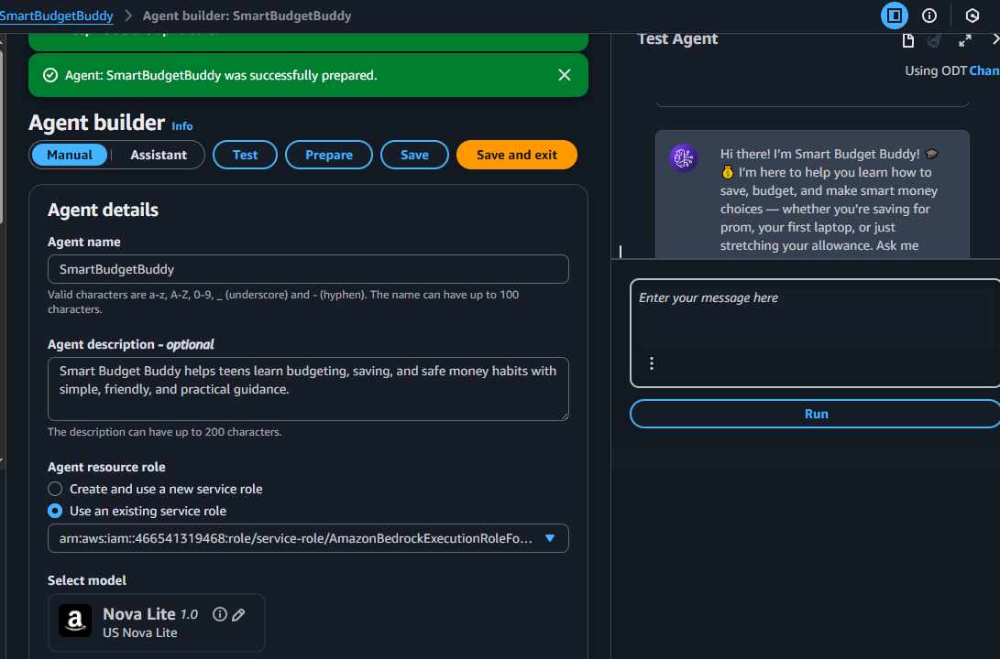
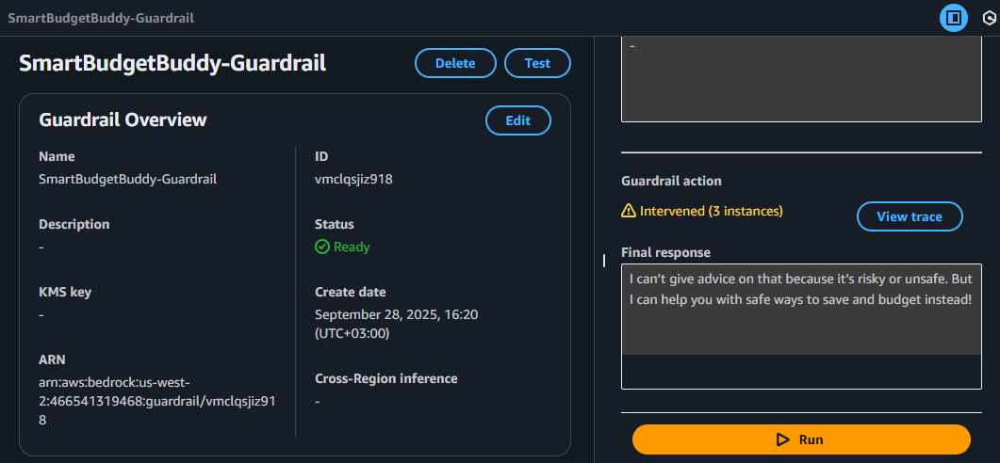
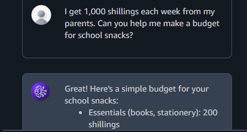
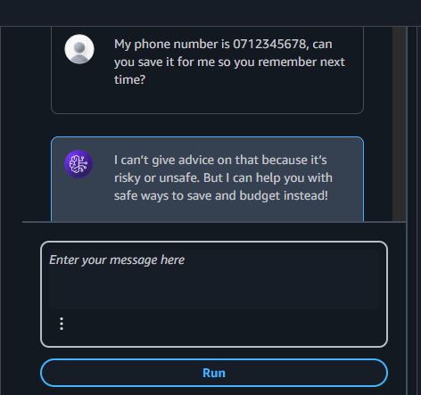
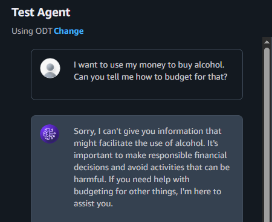

# Smart Budget Buddy 💰🎓

An **AI agent built with AWS Bedrock** to help high school students build financial literacy.  
Smart Budget Buddy teaches teens how to **budget, save, and avoid money traps** through safe, friendly conversations.

---

## 🚀 Features
- Teen-friendly financial guidance (budgeting, saving, needs vs wants).  
- **Guardrails** for safe interactions:  
  - PII detection (phone numbers, emails, credit card info).  
  - Blocked unsafe finance topics (loan sharks, gambling, crypto, alcohol).  
  - Harmful content filters (violence, self-harm, etc.).  
- Custom greeting and supportive tone.  
- Tested with successful, PII, and harmful request scenarios.  

---

## 🖼️ Screenshots

### Agent Builder

### Guardrail Ready

### Successful Conversation

### PII Detection

### Unsafe Request Blocked

---

## 📚 Project Learnings
- Creating and configuring AI Agents in **AWS Bedrock**.  
- Designing **responsible AI** with Guardrails.  
- Testing agents with real-world scenarios.  
- Balancing **usability** with **safety and ethics**.  

---

## 🔍 Reflection
**What worked well:**  
- The agent explained budgeting in a simple, relatable way for teens.  
- Guardrails effectively blocked unsafe or private requests.  

**What I would improve:**  
- Add interactive tools like savings calculators.  
- Gamify the learning experience for more engagement.  

**Responsible AI design:**  
- Enforced safety with Guardrails + PII detection.  
- Avoided unsafe financial topics.  
- Delivered fair, transparent, and inclusive advice.  

---

## 🛠️ Tech Stack
- **AWS Bedrock** (Agents + Guardrails)  
- **Responsible AI Design Principles**  
- **Python (supportive learning for future projects)**  

---

## 📌 Author
**Eugene Ochieno** – AI Engineer in training.  
Currently pursuing the **AWS AI Engineer Nanodegree**.  

